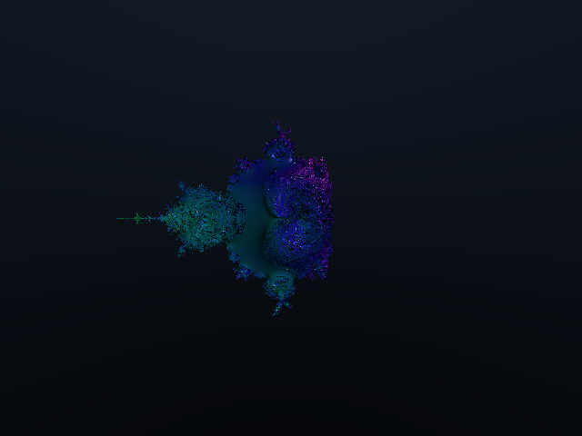
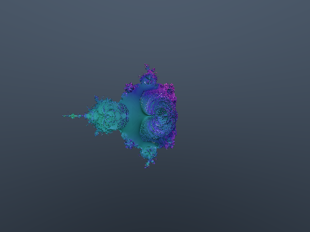

# Mandelbulb 3D Explorer - Colorful Edition

マンデルバルブ（Mandelbulb）3Dフラクタルをリアルタイムで探索できるビューアです。CPU版とGPU版の2つのレンダリング実装を提供しています。

## スクリーンショット

| CPU版 | GPU版 |
|:-----:|:-----:|
|  |  |

## 目次

- [Mandelbulb 3D Explorer - Colorful Edition](#mandelbulb-3d-explorer---colorful-edition)
  - [スクリーンショット](#スクリーンショット)
  - [目次](#目次)
  - [特徴](#特徴)
  - [プロジェクト構造](#プロジェクト構造)
  - [必要環境](#必要環境)
  - [ビルドと実行](#ビルドと実行)
    - [CPU版（Rayon並列）](#cpu版rayon並列)
    - [GPU版（wgpu + WGSL）](#gpu版wgpu--wgsl)
  - [操作方法](#操作方法)
    - [カメラ移動](#カメラ移動)
    - [カメラ回転](#カメラ回転)
    - [形状変更](#形状変更)
    - [その他](#その他)
  - [CPU版 vs GPU版](#cpu版-vs-gpu版)
  - [技術詳細](#技術詳細)
    - [レイマーチング](#レイマーチング)
    - [カラーリング手法](#カラーリング手法)
    - [GPU版の実装](#gpu版の実装)
    - [使用ライブラリ](#使用ライブラリ)
    - [参考文献](#参考文献)
  - [パラメータ設定](#パラメータ設定)
    - [CPU版](#cpu版)
    - [GPU版](#gpu版)
  - [ライセンス](#ライセンス)

## 特徴

- 🎨 **カラフルなレンダリング** - HSVカラースペースを使用した虹色グラデーション
- 🔮 **リアルタイム形状変更** - 1-9キーでパワー値を変更し、形状の複雑さを調整
- 💡 **高度なライティング** - 複数光源、スペキュラーハイライト、アンビエントオクルージョン
- ⚡ **2つのレンダリング実装** - CPU並列版とGPUシェーダー版
- 🌈 **動的カラーリング** - 反復回数、法線方向、オービットトラップに基づく色計算
- 🚀 **最適化された数学計算** - `glam` クレートによるSIMD最適化されたベクトル演算

## プロジェクト構造

```text
mandelbulb_3d/
├── Cargo.toml          # CPU版の依存関係 (minifb, rayon, glam)
├── src/
│   └── main.rs         # CPU版（Rayon並列レンダリング）
├── gpu/                # GPU版サブプロジェクト
│   ├── Cargo.toml      # GPU版の依存関係（wgpu, winit, glam, etc.）
│   ├── src/
│   │   └── main.rs     # GPU版メインコード
│   └── shaders/
│       └── mandelbulb.wgsl  # WGSLシェーダー
└── README.md
```

## 必要環境

- Rust 1.70以上
- Cargo
- GPU版: Metal (Mac) / Vulkan (Linux) / DX12 (Windows) 対応GPU

> **開発・動作確認環境:** macOS (Apple Silicon M1)

## ビルドと実行

### CPU版（Rayon並列）

```bash
# リリースビルドで実行（推奨）
cargo run --release

# デバッグビルドで実行
cargo run
```

### GPU版（wgpu + WGSL）

```bash
cd gpu

# リリースビルドで実行（推奨）
cargo run --release

# デバッグビルドで実行
cargo run
```

> **Note:** GPU版はMacではMetalバックエンド、WindowsではDX12/Vulkan、LinuxではVulkanを使用します。

## 操作方法

両バージョンで共通の操作方法です。

### カメラ移動

| キー | 操作 |
|------|------|
| W | 前進 |
| S | 後退 |
| A | 左移動 |
| D | 右移動 |
| Space | 上昇 |
| Left Shift | 下降 |

### カメラ回転

| キー | 操作 |
|------|------|
| ← | 左回転 |
| → | 右回転 |
| ↑ | 上を向く |
| ↓ | 下を向く |

### 形状変更

| キー | パワー値 | 複雑さ |
|------|----------|--------|
| 1 | 2 | シンプル（デフォルト） |
| 2 | 3 | |
| 3 | 4 | |
| 4 | 5 | |
| 5 | 6 | |
| 6 | 7 | |
| 7 | 8 | 標準 |
| 8 | 9 | |
| 9 | 12 | 非常に複雑 |

### その他

| キー | 操作 |
|------|------|
| P | スクリーンショット保存（`assets/`フォルダに保存） |
| R | リセット |
| Esc / Q | 終了 |

## CPU版 vs GPU版

| 項目 | CPU版 | GPU版 |
|------|-------|-------|
| **レンダリング** | Rayon並列（マルチスレッド） | WGSLフラグメントシェーダー |
| **ウィンドウ** | minifb | winit + wgpu |
| **パフォーマンス** | CPUコア数に依存 | GPU性能に依存（通常高速） |
| **依存関係** | 軽量（minifb, rayon, glam） | 重い（wgpu, winit, pollster, glam） |
| **互換性** | ほぼ全環境 | GPU必要（Metal/Vulkan/DX12） |

## 技術詳細

### レイマーチング

距離推定関数（Distance Estimator）を使用してマンデルバルブの表面を検出します。各ピクセルからレイを発射し、フラクタル表面との交点を求めます。

### カラーリング手法

色は以下の4つの要素を組み合わせて計算されます：

1. **反復回数** - フラクタル計算の反復回数に基づく色相
2. **法線方向** - 表面の向きに基づく色相変化
3. **オービットトラップ** - 原点からの最小距離に基づく色
4. **3D位置** - 空間座標に基づく色相

### GPU版の実装

GPU版はWGSL（WebGPU Shading Language）でシェーダーを実装しています：

- **頂点シェーダー**: フルスクリーン三角形を生成
- **フラグメントシェーダー**: 各ピクセルでレイマーチングを実行
- **データ受け渡し**: Rust側で `glam` と `bytemuck` を使用して16バイトアライメントされたデータをUniformバッファ経由で転送

### 使用ライブラリ

- **glam**: 高速な線形代数ライブラリ。SIMD命令を活用し、ベクトルや行列計算を最適化しています。
- **Rayon** (CPU版): データ並列処理ライブラリ。スキャンラインごとの並列レンダリングを実現。
- **wgpu** (GPU版): 安全でポータブルなGPU API。WebGPU規格に基づいたクロスプラットフォームなグラフィックス処理。

### 参考文献

- [Distance Estimated 3D Fractals (Inigo Quilez)](http://blog.hvidtfeldts.net/index.php/2011/09/distance-estimated-3d-fractals-v-the-mandelbulb-different-de-approximations/)

## パラメータ設定

### CPU版

`src/main.rs` 内の定数を変更：

```rust
const WIDTH: usize = 640;       // 解像度（幅）
const HEIGHT: usize = 480;      // 解像度（高さ）
const MAX_STEPS: usize = 150;   // レイマーチングの最大ステップ数
const MAX_ITER: usize = 12;     // フラクタル計算の反復回数
```

### GPU版

`gpu/shaders/mandelbulb.wgsl` 内の定数を変更：

```wgsl
const MAX_STEPS: u32 = 100u;    // レイマーチングの最大ステップ数
const MAX_ITER: u32 = 10u;      // フラクタル計算の反復回数
const EPSILON: f32 = 0.001;     // 衝突判定の微小距離
```

## ライセンス

MIT License
