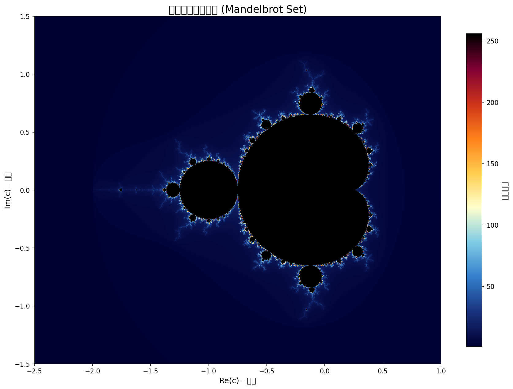

# マンデルブロ集合ビューア

M1 Mac (Apple Silicon) 対応の Python 製インタラクティブ・マンデルブロ集合描画ツール。
**Rust拡張により64倍高速化**に対応。



## 目次

- [マンデルブロ集合ビューア](#マンデルブロ集合ビューア)
  - [目次](#目次)
  - [必要環境](#必要環境)
  - [インストール](#インストール)
    - [依存ライブラリ](#依存ライブラリ)
  - [Rust拡張のビルド（オプション）](#rust拡張のビルドオプション)
  - [使い方](#使い方)
  - [操作方法](#操作方法)
  - [パフォーマンス](#パフォーマンス)
  - [ファイル構成](#ファイル構成)
  - [設定のカスタマイズ](#設定のカスタマイズ)
  - [ライセンス](#ライセンス)

## 必要環境

- Python 3.10+
- macOS (M1/M2/M3 Mac 対応)
- Rust (Rust拡張を使用する場合)

## インストール

```bash
pip install -r requirements.txt
```

### 依存ライブラリ

- `numpy` - 高速なベクトル化計算
- `matplotlib` - グラフ描画・GUI

## Rust拡張のビルド（オプション）

Rust拡張をビルドすると計算が**64倍高速化**されます。

```bash
# 仮想環境を作成
python3 -m venv .venv
source .venv/bin/activate

# 依存関係をインストール
pip install numpy matplotlib maturin

# Rust拡張をビルド
cd rust_ext
maturin develop --release
cd ..
```

> **Note**: Rust拡張がビルドされていない場合でも、Pure Python版で動作します。

## 使い方

```bash
# Rust拡張を使用する場合
source .venv/bin/activate
python mandelbrot.py

# Pure Python版
python mandelbrot.py
```

## 操作方法

| 操作 | 機能 |
|------|------|
| マウスホイール上 | ズームイン (0.8倍) |
| マウスホイール下 | ズームアウト (1.25倍) |
| 左クリック | クリック位置を中心に移動（パン） |
| 右クリック | クリック位置を中心にズームイン (0.8倍) |
| `r` キー | 初期表示にリセット |
| `s` キー | 現在の表示を画像として保存 |
| `q` キー | 終了 |

## パフォーマンス

| 実装 | 計算時間 (800x600, 256反復) | 高速化 |
|------|---------------------------|-------|
| Pure Python (NumPy) | 0.85秒 | - |
| **Rust (rayon並列)** | **0.013秒** | **64倍** |

## ファイル構成

```text
python/
├── mandelbrot.py      # メインスクリプト
├── requirements.txt   # Python依存関係
├── mandelbrot.png     # サンプル画像
├── README.md          # このファイル
└── rust_ext/          # Rust拡張モジュール
    ├── Cargo.toml     # Rust依存関係
    └── src/lib.rs     # 並列計算実装 (PyO3 + rayon)
```

## 設定のカスタマイズ

`mandelbrot.py` 内の `ViewerConfig` クラスで各種設定を変更できます：

| 設定項目 | デフォルト値 | 説明 |
|----------|-------------|------|
| `DEFAULT_WIDTH` | 800 | 画像幅 (ピクセル) |
| `DEFAULT_HEIGHT` | 600 | 画像高さ (ピクセル) |
| `DEFAULT_MAX_ITER` | 256 | 最大反復回数 |
| `ZOOM_FACTOR_SCROLL_IN` | 0.8 | スクロールズームイン倍率 |
| `ZOOM_FACTOR_SCROLL_OUT` | 1.25 | スクロールズームアウト倍率 |
| `SAVE_DPI` | 150 | 保存画像の解像度 |

## ライセンス

MIT License
